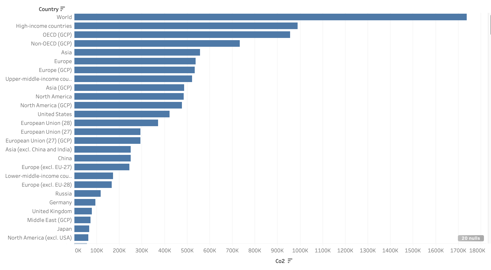
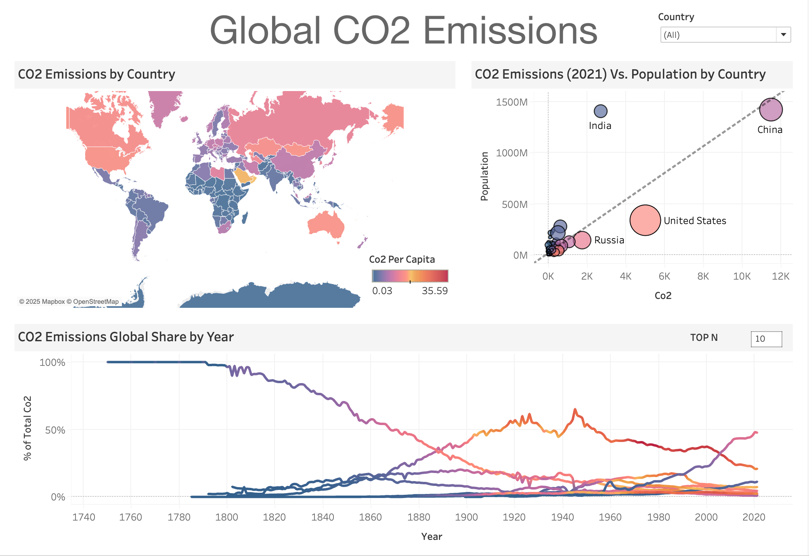

# Global CO₂ Emissions Analysis

## 1. Project Overview

**Objective**

The main goal of this project is to analyze and visualize carbon emissions data from 1750 to 2022. By building a dynamic Tableau dashboard, we aim to identify patterns, trends, and drivers of global CO₂ emissions and provide insights into how different countries have contributed over time.

**Dataset**
    - Source: [Insert any public dataset source if applicable, e.g., OurWorldInData, etc.]
    - Coverage: Global CO₂ emissions data, containing 79 columns, including emissions from cement, gas, oil, coal, flaring, land use change, as well as methane, nitrous oxide, and per capita metrics.

**Tools & Technologies**
    - Tableau for interactive dashboards and data visualizations.

## 2. Data Preparation & Methodology

**2.1 Data Profiling:**

1. Initial Inspection
    - The dataset contained 79 columns, including various greenhouse gases (CO₂, CH₄, N₂O) and derived metrics such as per capita emissions.
    - Many rows contained sub-groupings (e.g., “Asia,” “European Union,” “High-income countries”) that aggregated multiple countries and potentially skewed our analysis.
2. Highlight Figures
Figure 1: CO₂ Emissions By Country

Demonstrated that the dataset included combined totals for regions that would distort analysis when viewing emissions at a country level.

**2.2 Data Cleaning:**

1. Filter NULL iso_codes
    - Rows without a valid ISO country code often represented aggregated groups or incomplete data.
    - Removing those ensured focus on actual countries and consistent analysis.
2. Convert CO₂-Related Columns to Numeric Types
    - Some emission columns were stored as strings or mixed types, requiring conversion to numeric types (float) for accurate aggregation and calculation.
3. Create a Parameter for Dashboard Customization
    - An integer parameter was added to enable flexible “Top N” filtering in Tableau, so users can dynamically choose how many countries to display in bar charts or other visualizations.

## 3. Exploratory Data Analysis (EDA)

1. Descriptive Statistics
    - Calculated summary statistics (mean, median, min, max) for key emissions metrics.
    - Observed wide differences in CO₂ emissions among countries.
2. Trends Over Time
    - Plotted CO₂ emissions from 1750 to 2022 to see the rise of industrial emissions in the 20th century.
    - Identified major turning points (e.g., post-Industrial Revolution, post-World War II).
3. Per Capita Insights
    - Comparing countries by per capita emissions provided another perspective on which countries emit the most relative to their population size.

## 4. Tableau Dashboard

**4.1 Overview of the Dashboard**

1. CO₂ Emissions by Country (Map View)
    - A color-coded choropleth map illustrating CO₂ emissions per capita.
    - Hover tooltips to display relevant metrics (ISO code, total CO₂, population, etc.).
2. CO₂ Emissions vs. Population (Bubble Chart)
    - Each bubble represents a country, sized by total CO₂ and positioned by emission levels vs. population.
    - Quick insight into large-population countries vs. high-emission countries.
3. Global Share of CO₂ Over Time (Line Chart)
    - Tracks how each country’s share of global emissions has changed since 1750.
    - Highlighting shifts in global power and industrial activity over centuries.

**4.2 Interactivity & Parameters**

1. Top N Filter
    - Enables users to view only the top N emitting countries in the line chart to reduce clutter.
2. Country Selection
    - Filters to let users pick differentCountries to compare.

## 5. Key Findings & Insights

1. Historic Dominance
    - Early industrial powers (e.g., certain European countries, the United States) dominated CO₂ emissions until the mid-20th century.
    - Over time, other countries (e.g., China, India) have increased their emissions.
2. Per Capita vs. Absolute Emissions
    - Some countries have large total CO₂ due to huge populations but moderate per capita rates; others have smaller populations but very high per capita rates.

## 6. View on Tableau Public

## 7. Acknowledgments

This project was completed as part of a guided learning experience with **Maven Analytics**. Special thanks to Maven Analytics for providing structured guidance and high-quality datasets to enhance analytical skills. 